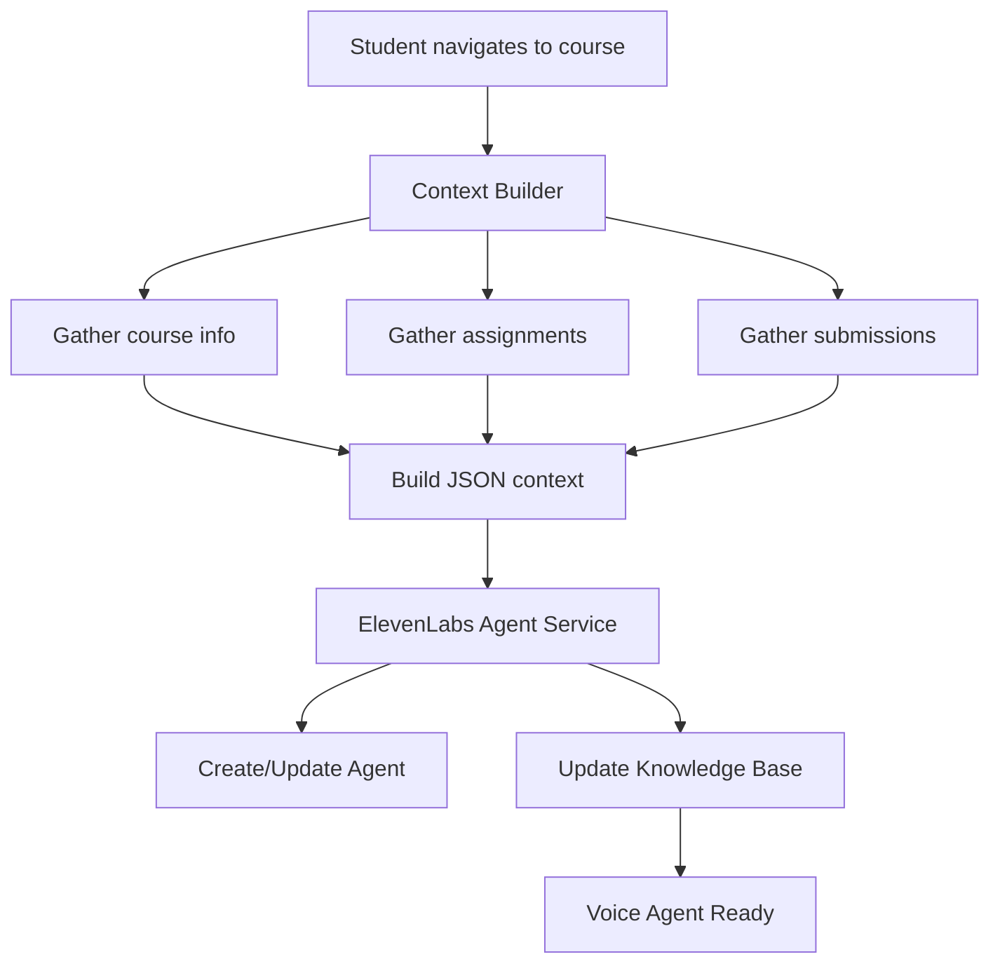

# AI Teaching Assistant (AI-TA)

A comprehensive AI-powered teaching assistant platform that helps educators manage courses, assignments, and student submissions with intelligent automation and feedback.

## Features

### 🤖 AI Teaching Assistant (Mylo)
- **Intelligent Task Processing**: Natural language understanding for course and assignment management
- **Conversational Interface**: Chat-based interaction with context awareness
- **Automated Actions**: Create, update, and manage courses and assignments through conversation

### 🎓 Course Management
- **Course Creation & Management**: Easy course setup with descriptions and enrollment
- **Assignment Management**: Create assignments with rubrics, due dates, and point values
- **Student Enrollment**: Manage student access to courses

### 📝 Assignment & Submission System
- **Rich Assignment Creation**: Support for detailed descriptions and custom rubrics
- **File Upload Support**: PDF submission handling with secure storage
- **Submission Tracking**: Monitor student progress and submission status

### 🔍 AI-Powered Grading
- **Automated Assessment**: AI-powered grading based on custom rubrics
- **Detailed Feedback**: Comprehensive feedback with strengths and improvement areas
- **Rubric-Based Scoring**: Precise evaluation against assignment criteria

### 🎤 **NEW: ElevenLabs Voice Agent Integration**
- **Course-Specific Voice Agents**: Dedicated AI voice assistant for each course
- **Context-Aware Conversations**: Agents know complete course context, assignments, and student progress
- **Automatic Knowledge Base Updates**: Real-time context updates when students navigate to course pages
- **Privacy-First Design**: Each student only accesses their own information through the voice agent
- **Smart Context Management**: Includes course details, assignment rubrics, submission status, and personalized feedback

## Tech Stack

### Backend
- **FastAPI**: Modern Python web framework
- **Supabase**: Database and authentication
- **OpenAI GPT**: Natural language processing and content generation
- **ElevenLabs**: Voice AI agent integration
- **Pydantic**: Data validation and serialization

### Frontend
- **React 18**: Modern React with hooks
- **TypeScript**: Type-safe development
- **Tailwind CSS**: Utility-first styling
- **Vite**: Fast build tool and dev server
- **Supabase Client**: Real-time database integration

## Architecture

### AI Agent System
The system features a sophisticated AI agent architecture:

1. **Mylo Agent**: Core text-based teaching assistant for course management
2. **Grading Agent**: Specialized agent for automated assignment evaluation
3. **Voice Agent**: ElevenLabs-powered voice assistant with course-specific knowledge

### Voice Agent Pipeline


### Database Schema
- **Users**: Student and teacher profiles with role-based access
- **Courses**: Course information with teacher associations
- **Assignments**: Assignment details with rubrics and due dates
- **Submissions**: Student submissions with files and grading data
- **Enrollments**: Student-course relationships

## Getting Started

### Prerequisites
- Python 3.8+
- Node.js 16+
- Supabase account
- OpenAI API key
- ElevenLabs API key (for voice agent features)

### Environment Variables

Create a `.env` file in the backend directory:

```env
# Required
SUPABASE_URL=your_supabase_url
SUPABASE_ANON_KEY=your_supabase_anon_key
SUPABASE_SERVICE_ROLE_KEY=your_supabase_service_key
OPENAI_API_KEY=your_openai_api_key

# Optional (for voice agent)
ELEVENLABS_API_KEY=your_elevenlabs_api_key

# Development
DEBUG=true
HOST=0.0.0.0
PORT=8000
```

### Backend Setup

```bash
cd backend
pip install -r requirements.txt
python main.py
```

### Frontend Setup

```bash
npm install
npm run dev
```

## API Endpoints

### Core Endpoints
- `POST /api/agent/process` - Main AI agent interaction
- `POST /api/agent/grade-submission` - Automated grading
- `GET /api/agent/health` - Service health check

### Voice Agent Endpoints
- `POST /api/voice-agent/update-context` - Update voice agent knowledge base
- `GET /api/voice-agent/context/{student_id}/{course_id}` - Retrieve current context
- `POST /api/voice-agent/test-context` - Test context building (development)
- `GET /api/voice-agent/health` - Voice agent service health

## Voice Agent Integration

### For Students
When a student navigates to a course page, the voice agent automatically:

1. **Gathers Context**: Collects course information, assignments, and the student's progress
2. **Updates Knowledge Base**: Uploads context to ElevenLabs agent for that course
3. **Enables Voice Interaction**: Student can now talk to a voice agent that knows their specific context

### Example Integration

```typescript
import { useVoiceAgentForCourse } from './hooks/useVoiceAgent'

function StudentCourseDetail({ courseId }) {
  const {
    context,
    isUpdating,
    isHealthy,
    error,
    updateCurrentCourse
  } = useVoiceAgentForCourse(courseId)

  return (
    <div>
      <h1>Course Details</h1>
      
      {/* Voice Agent Status */}
      <VoiceAgentStatus 
        courseId={courseId}
        courseName="CS500"
        showDetailedStatus={true}
      />
      
      {/* Course content */}
    </div>
  )
}
```

### Context Structure
The voice agent receives structured context including:

```json
{
  "student": {
    "id": "student-uuid",
    "name": "John Doe",
    "email": "john@university.edu"
  },
  "course": {
    "id": "course-uuid",
    "title": "CS500 - Advanced Programming",
    "description": "Course description...",
    "assignments": [
      {
        "id": "assignment-uuid",
        "title": "Final Project",
        "description": "Build a web application...",
        "due_date": "2024-12-15",
        "total_points": 100,
        "rubric": "Detailed rubric content...",
        "has_submission": true,
        "grade": 85,
        "feedback": "Great work on the implementation..."
      }
    ]
  }
}
```

## Development Features

### Authentication
- Supabase Auth integration
- Role-based access (student/teacher)
- JWT token management

### Real-time Updates
- Live submission tracking
- Instant grade publication
- Chat thread management

### File Handling
- PDF upload and processing
- Secure file storage
- Text extraction for grading

## Contributing

1. Fork the repository
2. Create a feature branch
3. Make your changes
4. Add tests if applicable
5. Submit a pull request

## License

This project is licensed under the MIT License - see the LICENSE file for details.

## Support

For questions or support, please open an issue in the GitHub repository or contact the development team.